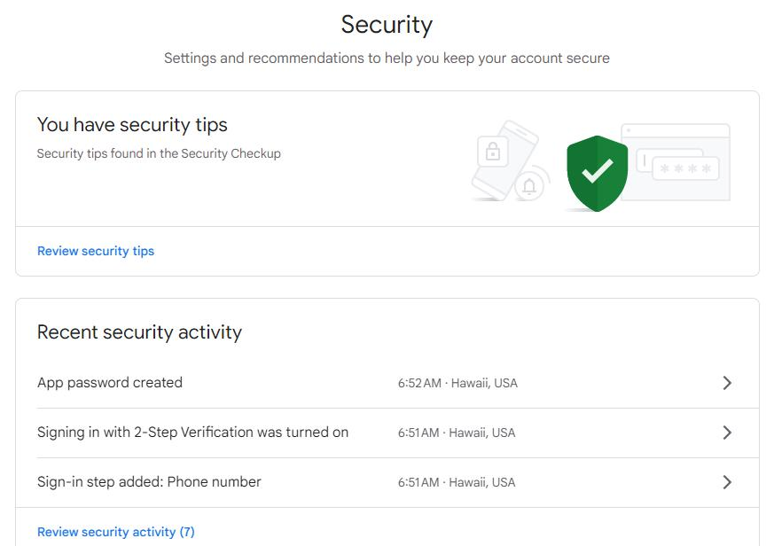
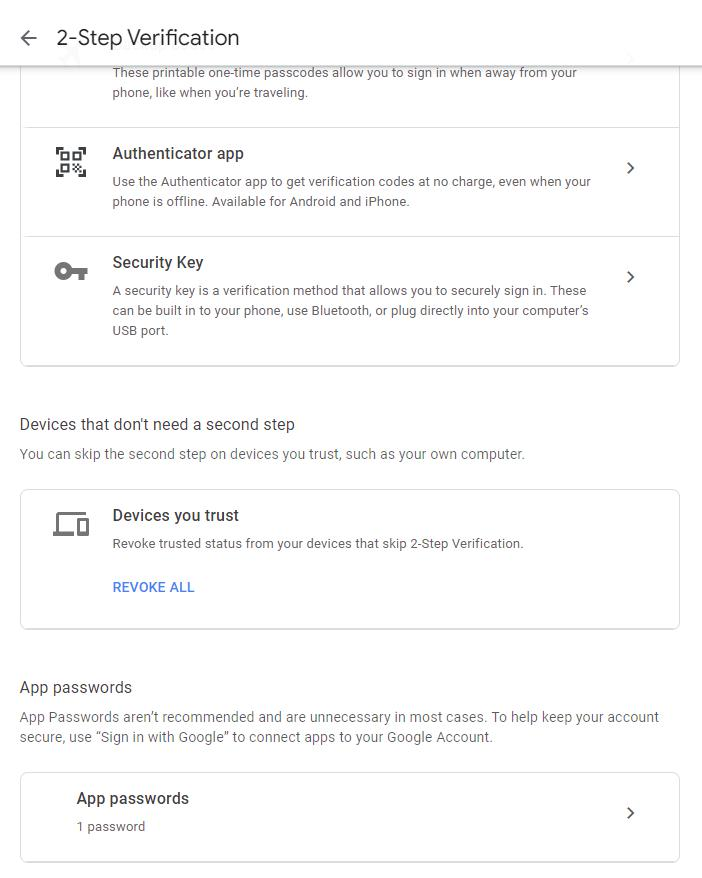
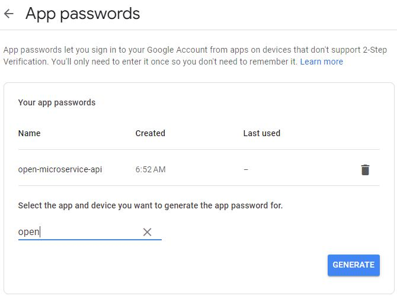
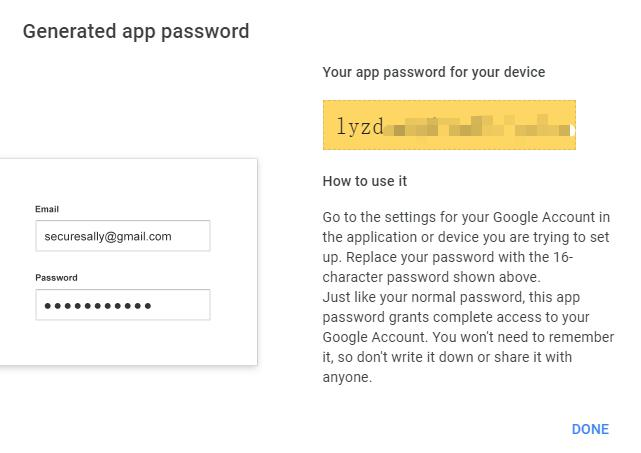

# open-microservice-api

1. send mail via google mail

## Install
set environment
```
PORT=8080;MAIL_USER=;MAIL_PASSWORD=
```
MAIL_USER is your google acount,MAIL_PASSWORD is your google account's app password
## Get Google Account App Password
[https://myaccount.google.com/security](https://myaccount.google.com/security)
turn on 2-Step Verification

App password

geneate app password

